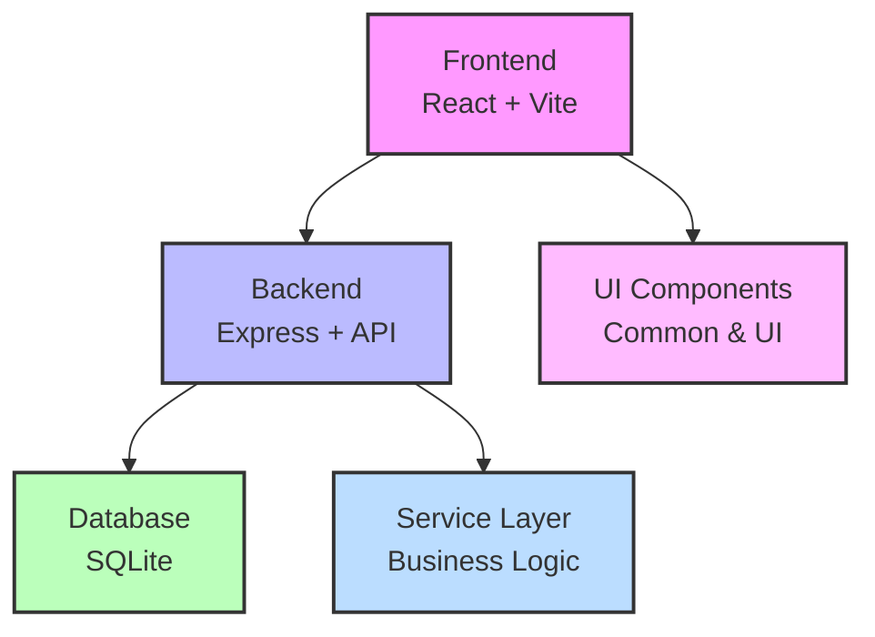

# Weinkeller - Wine Inventory Management System

A full-stack application for managing your wine inventory, built with Node.js, Express, React, and SQLite.

# DISCLAIMER & LICENSE INFORMATION

This repository was created through "vibe coding" with the help of Claude 3.7 Sonnet (20250219). While efforts have been made to create functional code, the author makes:

**NO WARRANTY OR GUARANTEE OF ANY KIND**, express or implied, including but not limited to the warranties of merchantability, fitness for a particular purpose, and noninfringement. The entire risk as to the quality and performance of this software rests with you.

**LIMITATION OF LIABILITY**: In no event shall the author be liable for any claim, damages, or other liability arising from, out of, or in connection with the software or the use or other dealings in the software.

This software is provided "AS IS" and the author disclaims all warranties with regard to this software. By using this repository, you acknowledge that you are doing so at your own risk.

This disclaimer is in addition to the terms specified in the GNU General Public License v3 (GPL3) under which this repository is distributed.

## Project Overview

Weinkeller is a comprehensive wine inventory management system that allows users to:

- Track wines in their collection
- Manage producers and wine details
- Record wine assessments and tasting notes
- Monitor inventory levels and consumption history
- Analyze wine collection with statistics and insights
- Export and import data for backup or transfer

## Tech Stack

- **Frontend**: React, CSS, Vite
- **Backend**: Node.js, Express
- **Database**: SQLite
- **Languages**: JavaScript
- **Internationalization**: i18next (supports English and German)
- **Documentation**: OpenAPI/Swagger

## Architecture Overview

The application follows a modern, layered architecture:



- **Frontend**: Organized into views, components, and services
- **Backend**: Implements a service layer between routes and models
- **Database**: SQLite for simple deployment and maintenance

## Project Structure

```
weinkeller/
├── backend/           # Backend Express application
│   ├── middleware/    # Express middleware
│   ├── models/        # Data models
│   ├── services/      # Business logic
│   └── utils/         # Utility functions
├── config/            # Configuration files
├── docs/              # Documentation
├── frontend/          # Frontend React application
│   ├── components/    # Reusable UI components
│   ├── services/      # API service layer
│   ├── styles/        # CSS styles
│   └── views/         # Page components
├── locales/           # Internationalization files
└── run/               # Runtime files
```

## Development

### Prerequisites

- Node.js (v14 or higher)
- npm (v6 or higher)

### Setup for Development

1. Clone the repository:
   ```bash
   git clone <repository-url>
   cd weinkeller
   ```

2. Install dependencies:
   ```bash
   npm install
   ```

3. Set up environment variables:
   ```bash
   cp config/.env.example .env
   ```

4. Start the development servers:
   ```bash
   # Start both backend and frontend in development mode
   npm run dev
   
   # Or start them separately
   npm run dev:backend   # Start only the backend
   npm run dev:frontend  # Start only the frontend
   ```

5. Access the application at http://localhost:3000

### Development Scripts

The project includes several npm scripts to help with development:

```bash
# Run tests
npm test

# Lint code
npm run lint

# Format code
npm run format

# Build for production
npm run build

# Start in production mode
npm start
```

## Deployment with Docker

This application is designed to be deployed as a stateless container with the SQLite database as a file mount.

### Prerequisites

- Docker

### Quick Start with Pre-built Images

The easiest way to get started is to use the pre-built Docker images from GitHub Container Registry:

1. Pull the image:
   ```bash
   # Using the latest version
   docker pull ghcr.io/philippkuntschik/weinkeller:latest
   
   # Or using a specific version (recommended for production)
   docker pull ghcr.io/philippkuntschik/weinkeller:0.1.0
   ```

2. Create a directory for the database:
   ```bash
   mkdir -p ~/weinkeller-data
   ```

3. Run the container:
   ```bash
   # Using the latest version
   docker run -d \
     --name weinkeller-app \
     -p 3000:3000 \
     -v ~/weinkeller-data:/data \
     -e NODE_ENV=production \
     -e DB_PATH=/data/wine_inventory.db \
     --restart unless-stopped \
     ghcr.io/philippkuntschik/weinkeller:latest
   
   # Or using a specific version (recommended for production)
   docker run -d \
     --name weinkeller-app \
     -p 3000:3000 \
     -v ~/weinkeller-data:/data \
     -e NODE_ENV=production \
     -e DB_PATH=/data/wine_inventory.db \
     --restart unless-stopped \
     ghcr.io/philippkuntschik/weinkeller:0.1.0
   ```

4. Access the application at http://localhost:3000

### Additional Docker Deployment Options

#### Building Your Own Docker Image

If you prefer to build your own Docker image:

```bash
# Clone the repository and navigate to it
git clone <repository-url>
cd weinkeller

# Build the Docker image
docker build -t weinkeller .

# Run the container
docker run -d \
  --name weinkeller-app \
  -p 3000:3000 \
  -v ~/weinkeller-data:/data \
  -e NODE_ENV=production \
  -e DB_PATH=/data/wine_inventory.db \
  --restart unless-stopped \
  weinkeller
```

#### Database Persistence Options

The application uses SQLite, which stores data in a file. You have several options for persisting this data:

1. **Standard mount** (as shown in examples above):
   ```bash
   -v ~/weinkeller-data:/data
   ```

2. **Alternative mount path** for app/run/database:
   ```bash
   -v ~/weinkeller-data:/app/run/database
   ```

3. **Custom directory location**:
   ```bash
   -v /path/to/your/data/directory:/data
   ```

#### Backup and Restore

Since the database file is directly accessible on your host system:

```bash
# Backup
cp ~/weinkeller-data/wine_inventory.db ~/wine_inventory_backup.db

# Restore
cp ~/wine_inventory_backup.db ~/weinkeller-data/wine_inventory.db
```

#### Running Without Docker

For the simplest setup, run directly on your host machine:

```bash
# Install dependencies
npm install

# Start the application
npm start
```

The database will be located at `./run/database/wine_inventory.db` relative to the project root.

#### Custom Configuration

Pass environment variables to customize the application:

```bash
docker run -d \
  --name weinkeller-app \
  -p 3000:3000 \
  -v ~/weinkeller-data:/data \
  -e NODE_ENV=production \
  -e DB_PATH=/data/wine_inventory.db \
  -e VITE_DEFAULT_LANGUAGE=de  # Set default language
  -e LOG_LEVEL=debug           # Enable detailed logging
  --restart unless-stopped \
  ghcr.io/philippkuntschik/weinkeller:latest
```

## CI/CD with GitHub Actions

This project includes GitHub Actions workflows for continuous integration and delivery:

### Docker Image Build and Publish

The project is configured to automatically build and publish Docker images to GitHub Container Registry (ghcr.io) using GitHub Actions.

- Images are built and published on:
  - Pushes to the main branch (tagged as `latest`, `{version}`, and `{version}-{datetime}`, e.g., `latest`, `1.0.0`, `1.0.0-202504241909`)
  - Release creation (tagged with semantic version)
  - Tag pushes matching the pattern `v*.*.*` (tagged with semantic version)

- Multi-platform images are built for:
  - `linux/amd64` (x86_64)
  - `linux/arm64` (ARM64/v8)

**Note:** Package visibility must be configured manually in the repository settings. To make packages public:
1. Go to your GitHub repository
2. Click on "Settings"
3. Click on "Packages" in the left sidebar
4. Under "Package Creation", select "Public" as the default visibility
5. Click "Save"

### Using Pre-built Images

For instructions on using the pre-built images from GitHub Container Registry, see the [Quick Start with Pre-built Images](#quick-start-with-pre-built-images) section above.

### Semantic Versioning

The project uses semantic versioning for releases. A GitHub Actions workflow is provided to automate version bumping:

1. Go to the "Actions" tab in your GitHub repository
2. Select the "Version Management" workflow
3. Click "Run workflow"
4. Choose the type of version bump:
   - `patch` for backwards-compatible bug fixes (1.0.0 → 1.0.1)
   - `minor` for backwards-compatible new features (1.0.0 → 1.1.0)
   - `major` for incompatible API changes (1.0.0 → 2.0.0)
5. Optionally enter a custom version number
6. Click "Run workflow"

This will:
- Create a new branch with the version change
- Update the version in package.json
- Create a pull request for the version bump
- Optionally create a release draft (if using custom version)

After merging the PR, you can create a new release with the tag `v1.2.3` (matching your version) to trigger the Docker image build with that version tag.

## Kubernetes Deployment with Helm

This project includes a Helm chart for deploying the application to Kubernetes clusters.

### Prerequisites

- Kubernetes cluster
- Helm 3.x installed
- kubectl configured to communicate with your cluster

### Installing the Chart

You can install the chart directly from the GitHub Container Registry:

```bash
# Add the Helm repository
helm pull oci://ghcr.io/philippkuntschik/helm/weinkeller --version 1.0.0

# Install the chart
helm install weinkeller ./weinkeller-1.0.0.tgz \
  --namespace weinkeller \
  --create-namespace \
  --set weinkeller.persistence.enabled=true \
  --set weinkeller.persistence.size=2Gi
```

Replace `1.0.0` with the desired version if needed.

### Configuration

The following table lists the configurable parameters of the Weinkeller chart and their default values:

| Parameter                           | Description                                      | Default                      |
|-------------------------------------|--------------------------------------------------|------------------------------|
| `replicaCount`                      | Number of replicas                               | `1`                          |
| `image.repository`                  | Image repository                                 | `ghcr.io/philippkuntschik/weinkeller`   |
| `image.tag`                         | Image tag                                        | `latest`                     |
| `image.pullPolicy`                  | Image pull policy                                | `IfNotPresent`               |
| `service.type`                      | Kubernetes Service type                          | `ClusterIP`                  |
| `service.port`                      | Service port                                     | `80`                         |
| `service.targetPort`                | Service target port                              | `3000`                       |
| `ingress.enabled`                   | Enable ingress controller resource               | `false`                      |
| `weinkeller.env.NODE_ENV`           | Node environment                                 | `production`                 |
| `weinkeller.env.LOG_LEVEL`          | Application log level                            | `info`                       |
| `weinkeller.persistence.enabled`    | Enable persistence using PVC                     | `true`                       |
| `weinkeller.persistence.size`       | PVC Storage Request size                         | `1Gi`                        |
| `weinkeller.persistence.accessMode` | PVC Access Mode                                  | `ReadWriteOnce`              |

### Persistence

The application uses SQLite as its database, which requires persistent storage. The chart creates a PersistentVolumeClaim to store the database file. You can configure the persistence settings in the `values.yaml` file or via the `--set` flag:

```bash
helm install weinkeller ./weinkeller-1.0.0.tgz \
  --set weinkeller.persistence.enabled=true \
  --set weinkeller.persistence.size=5Gi \
  --set weinkeller.persistence.storageClass=standard
```

### Upgrading the Chart

To upgrade the deployment:

```bash
helm upgrade weinkeller ./weinkeller-1.0.0.tgz \
  --set image.tag=1.1.0
```

### Uninstalling the Chart

To uninstall/delete the deployment:

```bash
helm uninstall weinkeller
```

This removes all the Kubernetes components associated with the chart and deletes the release.

**Note:** The PersistentVolumeClaim is not deleted automatically. If you want to delete it, run:

```bash
kubectl delete pvc -l app.kubernetes.io/instance=weinkeller
```

## Troubleshooting

If you encounter issues with the application, here are some debugging steps:

### Logging and Diagnostics

```bash
# Enable detailed logging
docker run -d \
  --name weinkeller-app \
  -p 3000:3000 \
  -v ~/weinkeller-data:/data \
  -e LOG_LEVEL=debug \  # Options: silly, debug, verbose, http, info, warn, error
  --restart unless-stopped \
  ghcr.io/philippkuntschik/weinkeller:latest

# View container logs
docker logs weinkeller-app
docker logs --tail 100 weinkeller-app  # Last 100 lines

# Access container shell
docker exec -it weinkeller-app /bin/sh

# Check container health
docker inspect --format='{{.State.Health.Status}}' weinkeller-app

# Check database accessibility
docker exec weinkeller-app ls -la /data/
```

### Common Issues

1. **Database permissions**: Test write access to the data directory
   ```bash
   docker exec weinkeller-app touch /data/test.txt
   ```

2. **Missing database file**: Initialize the database if needed
   ```bash
   docker exec -e DB_INIT_ONLY=true weinkeller-app node backend/server.js
   ```

3. **Port conflicts**: Check if port 3000 is already in use
   ```bash
   netstat -tuln | grep 3000
   ```

4. **Resource limitations**: Check container resource usage
   ```bash
   docker stats weinkeller-app
   ```
