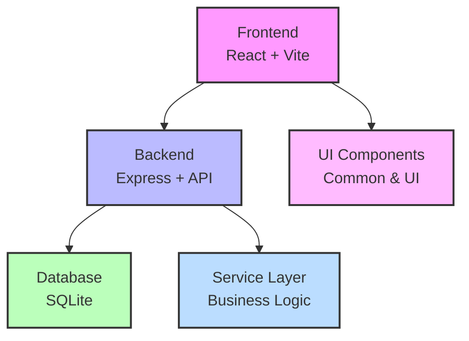

# Weinkeller - Wine Inventory Management System

A full-stack application for managing your wine inventory, built with Node.js, Express, React, and SQLite.

## Project Overview

Weinkeller is a comprehensive wine inventory management system that allows users to:

- Track wines in their collection
- Manage producers and wine details
- Record wine assessments and tasting notes
- Monitor inventory levels and consumption history
- Analyze wine collection with statistics and insights
- Export and import data for backup or transfer

## Tech Stack

- **Frontend**: React, CSS, Vite
- **Backend**: Node.js, Express
- **Database**: SQLite
- **Languages**: JavaScript
- **Internationalization**: i18next (supports English and German)
- **Documentation**: OpenAPI/Swagger

## Architecture Overview

The application follows a modern, layered architecture:



- **Frontend**: Organized into views, components, and services
- **Backend**: Implements a service layer between routes and models
- **Database**: SQLite for simple deployment and maintenance

## Project Structure

```
weinkeller/
├── backend/           # Backend Express application
│   ├── middleware/    # Express middleware
│   ├── models/        # Data models
│   ├── services/      # Business logic
│   └── utils/         # Utility functions
├── config/            # Configuration files
├── docs/              # Documentation
├── frontend/          # Frontend React application
│   ├── components/    # Reusable UI components
│   ├── services/      # API service layer
│   ├── styles/        # CSS styles
│   └── views/         # Page components
├── locales/           # Internationalization files
└── run/               # Runtime files
```

## Development

### Prerequisites

- Node.js (v14 or higher)
- npm (v6 or higher)

### Setup for Development

1. Clone the repository:
   ```bash
   git clone <repository-url>
   cd weinkeller
   ```

2. Install dependencies:
   ```bash
   npm install
   ```

3. Set up environment variables:
   ```bash
   cp config/.env.example .env
   ```

4. Start the development servers:
   ```bash
   # Start both backend and frontend in development mode
   npm run dev
   
   # Or start them separately
   npm run dev:backend   # Start only the backend
   npm run dev:frontend  # Start only the frontend
   ```

5. Access the application at http://localhost:3000

### Development Scripts

The project includes several npm scripts to help with development:

```bash
# Run tests
npm test

# Lint code
npm run lint

# Format code
npm run format

# Build for production
npm run build

# Start in production mode
npm start
```

## Deployment with Docker

This application is designed to be deployed as a stateless container with the SQLite database as a file mount.

### Prerequisites

- Docker

### Deployment with Docker

Since this application uses SQLite (a file-based database), you can deploy it using a simple Docker container without needing Docker Compose.

### Quick Start with Docker (Recommended for SQLite)

1. Clone the repository:
   ```bash
   git clone <repository-url>
   cd weinkeller
   ```

2. Create a directory for the database:
   ```bash
   # Create a directory for the database on your host machine
   mkdir -p ~/weinkeller-data
   ```

3. Build the Docker image:
   ```bash
   docker build -t weinkeller .
   ```

4. Run the container with the directory mounted:
   ```bash
   docker run -d \
     --name weinkeller-app \
     -p 3000:3000 \
     -v ~/weinkeller-data:/data \
     -e NODE_ENV=production \
     -e DB_PATH=/data/wine_inventory.db \
     --restart unless-stopped \
     weinkeller
   ```

5. Access the application at http://localhost:3000


### Database Persistence

#### Using Bind Mounts

Instead of using Docker volumes, you can use bind mounts to store the SQLite database directly in a directory on your host machine. This makes it easier to access, backup, and manage the database file directly.

```bash
# Create a directory for the database
mkdir -p ~/weinkeller-data

# Run the container with a bind mount
docker run -d \
  --name weinkeller-app \
  -p 3000:3000 \
  -v ~/weinkeller-data:/app/run/database \
  weinkeller
```

With this approach, the database file will be stored at `~/weinkeller-data/wine_inventory.db` on your host machine, making it easy to:
- Access the database file directly
- Make manual backups by simply copying the file
- Use standard file system tools for management
- Migrate the database to another system

##### Backup and Restore with Bind Mounts

Since the database file is directly accessible on your host system, you can backup and restore it using standard file operations:

To backup:
```bash
cp ~/weinkeller-data/wine_inventory.db ~/wine_inventory_backup.db
```

To restore:
```bash
cp ~/wine_inventory_backup.db ~/weinkeller-data/wine_inventory.db
```

#### Option 3: Running Without Docker

For the simplest setup, you can run the application directly on your host machine without Docker. In this case, the SQLite database will be stored in the `run/database/` directory of the project.

```bash
# Install dependencies
npm install

# Start the application
npm start
```

The database will be located at `./run/database/wine_inventory.db` relative to the project root.

### Custom Configuration

You can pass environment variables directly to the container:

```bash
docker run -d \
  --name weinkeller-app \
  -p 3000:3000 \
  -v ~/weinkeller-data:/data \
  -e NODE_ENV=production \
  -e DB_PATH=/data/wine_inventory.db \
  -e VITE_DEFAULT_LANGUAGE=de \
  -e LOG_LEVEL=debug \
  --restart unless-stopped \
  weinkeller
```

### Custom Directory Location

You can mount a host directory directly:

```bash
docker run -d \
  --name weinkeller-app \
  -p 3000:3000 \
  -v /path/to/your/data/directory:/data \
  -e NODE_ENV=production \
  -e DB_PATH=/data/wine_inventory.db \
  --restart unless-stopped \
  weinkeller
```

## CI/CD with GitHub Actions

This project includes GitHub Actions workflows for continuous integration and delivery:

### Docker Image Build and Publish

The project is configured to automatically build and publish Docker images to GitHub Container Registry (ghcr.io) using GitHub Actions.

- Images are built and published on:
  - Pushes to the main branch (tagged as `latest`)
  - Release creation (tagged with semantic version)
  - Tag pushes matching the pattern `v*.*.*` (tagged with semantic version)

- Multi-platform images are built for:
  - `linux/amd64` (x86_64)
  - `linux/arm64` (ARM64/v8)

### Using Pre-built Images

You can use the pre-built images directly from GitHub Container Registry:

```bash
# Pull the latest image
docker pull ghcr.io/OWNER/weinkeller:latest

# Run the container
docker run -d \
  --name weinkeller-app \
  -p 3000:3000 \
  -v ~/weinkeller-data:/data \
  -e NODE_ENV=production \
  -e DB_PATH=/data/wine_inventory.db \
  --restart unless-stopped \
  ghcr.io/OWNER/weinkeller:latest
```

Replace `OWNER` with your GitHub username or organization name.

### Semantic Versioning

The project uses semantic versioning for releases. A GitHub Actions workflow is provided to automate version bumping:

1. Go to the "Actions" tab in your GitHub repository
2. Select the "Version Management" workflow
3. Click "Run workflow"
4. Choose the type of version bump:
   - `patch` for backwards-compatible bug fixes (1.0.0 → 1.0.1)
   - `minor` for backwards-compatible new features (1.0.0 → 1.1.0)
   - `major` for incompatible API changes (1.0.0 → 2.0.0)
5. Optionally enter a custom version number
6. Click "Run workflow"

This will:
- Create a new branch with the version change
- Update the version in package.json
- Create a pull request for the version bump
- Optionally create a release draft (if using custom version)

After merging the PR, you can create a new release with the tag `v1.2.3` (matching your version) to trigger the Docker image build with that version tag.

## Kubernetes Deployment with Helm

This project includes a Helm chart for deploying the application to Kubernetes clusters.

### Prerequisites

- Kubernetes cluster
- Helm 3.x installed
- kubectl configured to communicate with your cluster

### Installing the Chart

You can install the chart directly from the GitHub Container Registry:

```bash
# Add the Helm repository
helm pull oci://ghcr.io/OWNER/charts/weinkeller --version 1.0.0

# Install the chart
helm install weinkeller ./weinkeller-1.0.0.tgz \
  --namespace weinkeller \
  --create-namespace \
  --set weinkeller.persistence.enabled=true \
  --set weinkeller.persistence.size=2Gi
```

Replace `OWNER` with your GitHub username or organization name, and `1.0.0` with the desired version.

### Configuration

The following table lists the configurable parameters of the Weinkeller chart and their default values:

| Parameter                           | Description                                      | Default                      |
|-------------------------------------|--------------------------------------------------|------------------------------|
| `replicaCount`                      | Number of replicas                               | `1`                          |
| `image.repository`                  | Image repository                                 | `ghcr.io/OWNER/weinkeller`   |
| `image.tag`                         | Image tag                                        | `latest`                     |
| `image.pullPolicy`                  | Image pull policy                                | `IfNotPresent`               |
| `service.type`                      | Kubernetes Service type                          | `ClusterIP`                  |
| `service.port`                      | Service port                                     | `80`                         |
| `service.targetPort`                | Service target port                              | `3000`                       |
| `ingress.enabled`                   | Enable ingress controller resource               | `false`                      |
| `weinkeller.env.NODE_ENV`           | Node environment                                 | `production`                 |
| `weinkeller.env.LOG_LEVEL`          | Application log level                            | `info`                       |
| `weinkeller.persistence.enabled`    | Enable persistence using PVC                     | `true`                       |
| `weinkeller.persistence.size`       | PVC Storage Request size                         | `1Gi`                        |
| `weinkeller.persistence.accessMode` | PVC Access Mode                                  | `ReadWriteOnce`              |

### Persistence

The application uses SQLite as its database, which requires persistent storage. The chart creates a PersistentVolumeClaim to store the database file. You can configure the persistence settings in the `values.yaml` file or via the `--set` flag:

```bash
helm install weinkeller ./weinkeller-1.0.0.tgz \
  --set weinkeller.persistence.enabled=true \
  --set weinkeller.persistence.size=5Gi \
  --set weinkeller.persistence.storageClass=standard
```

### Upgrading the Chart

To upgrade the deployment:

```bash
helm upgrade weinkeller ./weinkeller-1.0.0.tgz \
  --set image.tag=1.1.0
```

### Uninstalling the Chart

To uninstall/delete the deployment:

```bash
helm uninstall weinkeller
```

This removes all the Kubernetes components associated with the chart and deletes the release.

**Note:** The PersistentVolumeClaim is not deleted automatically. If you want to delete it, run:

```bash
kubectl delete pvc -l app.kubernetes.io/instance=weinkeller
```

## Troubleshooting

If you encounter issues such as "Internal Server Error" when accessing the application, here are some debugging steps:

### Enabling Detailed Logging

The application uses Winston for logging with configurable log levels. You can enable more detailed logging by setting the `LOG_LEVEL` environment variable:

```bash
docker run -d \
  --name weinkeller-app \
  -p 3000:3000 \
  -v ~/weinkeller-data:/data \
  -e NODE_ENV=production \
  -e DB_PATH=/data/wine_inventory.db \
  -e LOG_LEVEL=debug \
  --restart unless-stopped \
  weinkeller
```

Available log levels (from most to least verbose):
- `silly` - Extremely detailed logging (not recommended for production)
- `debug` - Detailed information useful for debugging
- `verbose` - More detailed than info
- `http` - HTTP request logging
- `info` - General information (default in production)
- `warn` - Warnings
- `error` - Errors only

The default log level is `info` in production and `debug` in development.

### Viewing Container Logs

Check the container logs to see any error messages:

```bash
docker logs weinkeller-app
```

For more detailed logs:

```bash
docker logs --tail 100 weinkeller-app
```

### Accessing the Container Shell

You can access the container's shell to debug from inside:

```bash
docker exec -it weinkeller-app /bin/sh
```

Once inside, you can:
- Check if the database file exists: `ls -la /data/`
- Verify Node.js is working: `node --version`
- Check environment variables: `env | grep DB_PATH`

### Checking Container Health

Verify the container's health status:

```bash
docker inspect --format='{{.State.Health.Status}}' weinkeller-app
```

### Verifying Database Connectivity

Check if the database file exists and is accessible:

```bash
docker exec weinkeller-app ls -la /data/
```

### Common Issues

1. **Database permissions**: Ensure the container has write permissions to the database directory:
   ```bash
   docker exec weinkeller-app touch /data/test.txt
   ```

2. **Missing database file**: If the database file doesn't exist, you may need to initialize it:
   ```bash
   docker exec -e DB_INIT_ONLY=true weinkeller-app node backend/server.js
   ```

3. **Port conflicts**: Ensure no other service is using port 3000:
   ```bash
   # Check if port 3000 is in use
   netstat -tuln | grep 3000
   ```

4. **Container resource limits**: The container might not have enough resources:
   ```bash
   docker stats weinkeller-app
   ```

## License
see LICENSE file
