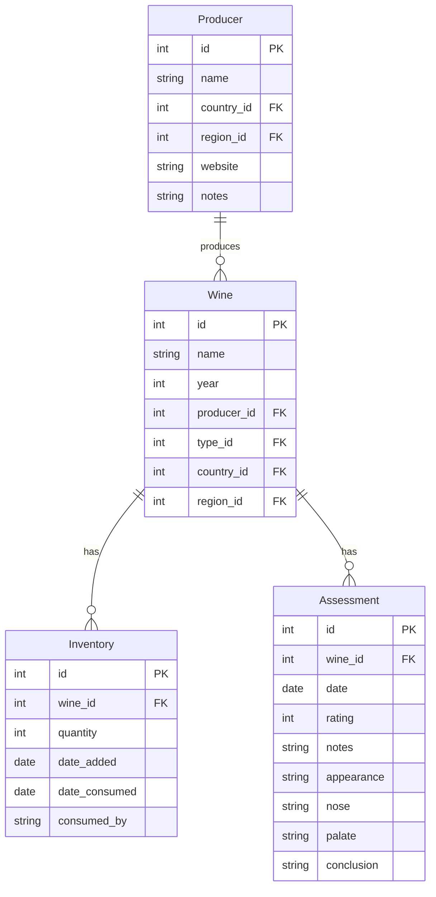

# Backend Models

This directory contains the data models for the Weinkeller application. These models define the structure of the data stored in the SQLite database and provide methods for interacting with that data.

## Database Schema

The application uses a SQLite database with the following schema:



## Models Overview

### WineModel (wineModel.js)

Represents a wine in the collection. Each wine has:
- Basic information (name, year, etc.)
- Relationships to producer, country, region
- Tags (grape varieties, wine type, etc.)

### ProducerModel (producerModel.js)

Represents a wine producer/winery. Each producer has:
- Basic information (name, website, etc.)
- Location information (country, region)
- Relationships to wines produced

### InventoryModel (inventoryModel.js)

Tracks the inventory of wines. Each inventory record has:
- Reference to a wine
- Quantity
- Date added
- Date consumed (if applicable)
- Consumption information

### AssessmentModel (AssessmentModel.js)

Stores wine tasting assessments. Each assessment has:
- Reference to a wine
- Rating
- Tasting notes (appearance, nose, palate, conclusion)
- Date of assessment

## Model Implementation

Each model follows a similar pattern:

```javascript
// Example: wineModel.js
const db = require('../db');

class WineModel {
  // Create a new wine
  static async create(wineData) {
    // SQL and implementation
  }
  
  // Get all wines
  static async getAll(filters = {}) {
    // SQL and implementation
  }
  
  // Get a wine by ID
  static async getById(id) {
    // SQL and implementation
  }
  
  // Update a wine
  static async update(id, wineData) {
    // SQL and implementation
  }
  
  // Delete a wine
  static async delete(id) {
    // SQL and implementation
  }
  
  // Model-specific methods
  static async getByProducer(producerId) {
    // SQL and implementation
  }
}

module.exports = WineModel;
```

## Data Relationships

### Wine and Producer

A wine belongs to one producer, and a producer can have many wines:

```javascript
// Get wines by producer
static async getByProducer(producerId) {
  return db.all(`
    SELECT * FROM wines
    WHERE producer_id = ?
    ORDER BY year DESC
  `, [producerId]);
}
```

### Wine and Inventory

A wine can have multiple inventory records:

```javascript
// Get current inventory for a wine
static async getCurrentInventory(wineId) {
  return db.get(`
    SELECT 
      SUM(CASE WHEN date_consumed IS NULL THEN quantity ELSE 0 END) as current_quantity
    FROM inventory
    WHERE wine_id = ?
  `, [wineId]);
}
```

### Wine and Assessment

A wine can have multiple assessments:

```javascript
// Get assessments for a wine
static async getAssessments(wineId) {
  return db.all(`
    SELECT * FROM assessments
    WHERE wine_id = ?
    ORDER BY date DESC
  `, [wineId]);
}
```

## Data Validation

Models include validation to ensure data integrity:

```javascript
static async create(wineData) {
  // Validate required fields
  if (!wineData.name || !wineData.producer_id) {
    throw new Error('Wine name and producer are required');
  }
  
  // Validate year format
  if (wineData.year && !/^\d{4}$/.test(wineData.year)) {
    throw new Error('Year must be a 4-digit number');
  }
  
  // Implementation...
}
```

## Transactions

For operations that affect multiple tables, the models use transactions to ensure data consistency:

```javascript
static async delete(id) {
  const db = await getDb();
  
  try {
    await db.run('BEGIN TRANSACTION');
    
    // Delete related records first
    await db.run('DELETE FROM wine_grapes WHERE wine_id = ?', [id]);
    await db.run('DELETE FROM inventory WHERE wine_id = ?', [id]);
    await db.run('DELETE FROM assessments WHERE wine_id = ?', [id]);
    
    // Delete the wine
    await db.run('DELETE FROM wines WHERE id = ?', [id]);
    
    await db.run('COMMIT');
    return true;
  } catch (error) {
    await db.run('ROLLBACK');
    throw error;
  }
}
```

## Best Practices

1. **Separation of Concerns**: Models handle data access only, not business logic
2. **Parameterized Queries**: All SQL queries use parameterized statements to prevent SQL injection
3. **Error Handling**: Comprehensive error handling with meaningful error messages
4. **Transactions**: Use transactions for operations that affect multiple tables
5. **Validation**: Validate data before inserting or updating
6. **Indexing**: Use appropriate database indexes for performance
7. **Relationships**: Properly manage relationships between tables
