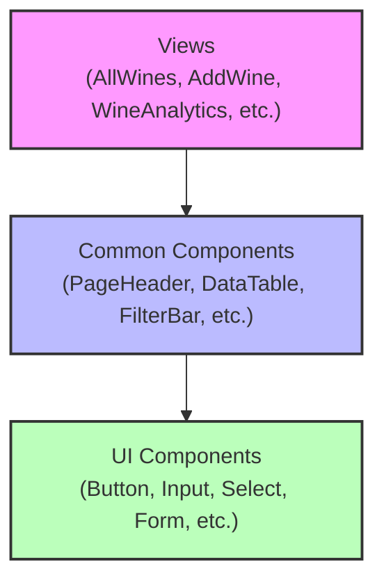

# Weinkeller Frontend

## Overview
The Weinkeller Frontend is a React-based web application designed to provide a seamless user experience for managing and exploring wine collections. It is built using modern web technologies and follows best practices for performance, maintainability, and user experience.

## Features
- Interactive user interface for wine collection management
- Integration with backend services for data synchronization
- Responsive design for optimal usability across devices
- Localization support for multiple languages (English and German)
- Component-based architecture for reusability and maintainability
- Form validation and error handling
- Data visualization for wine analytics

## Project Structure
```
frontend/
├── App.js                # Main application component
├── config.js             # Frontend configuration
├── i18n.js               # Internationalization setup
├── index.css             # Global CSS
├── index.html            # HTML entry point
├── main.jsx              # Application entry point
├── components/           # Reusable UI components
│   ├── common/           # Common components (headers, tables, etc.)
│   ├── ui/               # Basic UI components (buttons, inputs, etc.)
│   ├── LanguageSwitcher.js  # Language selection component
│   └── TagsInput.js      # Tag input component
├── services/             # API service layer
│   ├── api.js            # Base API client
│   ├── wineService.js    # Wine-related API operations
│   ├── producerService.js # Producer-related API operations
│   └── ...               # Other service modules
├── styles/               # CSS styles
│   ├── global.css        # Global styles
│   ├── variables.css     # CSS variables
│   └── ...               # Component-specific styles
└── views/                # Page components
    ├── AllWines.js       # Wine listing page
    ├── AddWine.js        # Wine creation page
    ├── WineAnalytics.js  # Wine analytics page
    └── ...               # Other page components
```

## Architecture

### Component Architecture
The frontend follows a component-based architecture:



- **Views**: Page-level components that compose the application
- **Common Components**: Reusable components specific to the application domain
- **UI Components**: Basic UI elements that can be used across any application

### State Management
The application uses React's built-in state management with hooks:
- `useState` for component-level state
- `useEffect` for side effects and data fetching
- Custom hooks for reusable logic

### API Integration
The frontend communicates with the backend through a service layer:
- `api.js` provides a base API client using Axios
- Service modules (e.g., `wineService.js`) provide domain-specific API operations
- Services handle error handling and data transformation

## Development Workflow

### Prerequisites
- Node.js (v14 or higher)
- npm (v6 or higher)

### Installation
1. Install dependencies:
   ```bash
   npm install
   ```

### Development
To start the development server:
```bash
npm run dev
```

The development server will be available at http://localhost:3000.

### Build
To create a production build:
```bash
npm run build
```

The build output will be in the `dist` directory.

### Internationalization
The application supports multiple languages using i18next:
- Language files are in the `locales` directory
- The default language is English
- Users can switch languages using the LanguageSwitcher component

### Adding New Components
1. Create a new component file in the appropriate directory
2. Import and use the component in a view or another component
3. Add styles in a separate CSS file
4. Update the component index file if applicable

### Adding New Views
1. Create a new view component in the `views` directory
2. Add the view to the routing configuration in `App.js`
3. Create any necessary service methods for data fetching

## Best Practices
- Use functional components with hooks
- Keep components small and focused
- Use the service layer for all API operations
- Follow the established component hierarchy
- Use CSS modules for component-specific styles
- Use the design system components for consistency
